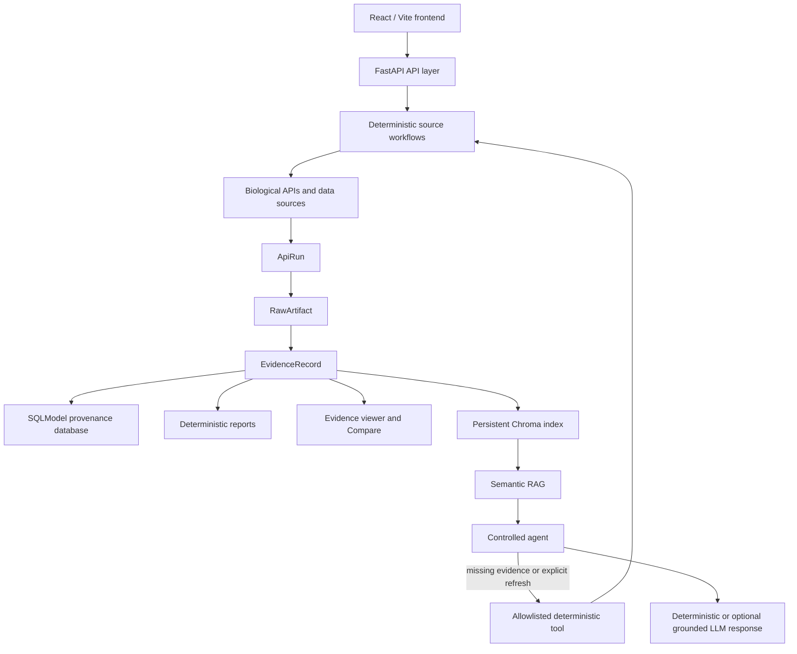

# CHDI Gene Intelligence

CHDI Gene Intelligence is a provenance-aware target-intelligence platform for generating and interrogating Huntington's disease-focused gene dossiers. It combines deterministic biological data retrieval, structured evidence storage, semantic retrieval-augmented generation (RAG), controlled allowlisted tool execution, optional grounded LLM synthesis, interactive reports, evidence inspection, and gene comparison.

**The LLM is not the scientific source of truth.** Scientific evidence comes from deterministic source workflows and normalized `EvidenceRecord` objects. An LLM, when configured, is limited to presenting retrieved evidence with validated citations.

## Why This Project Exists

Target dossiers require evidence distributed across gene-identity, genomic and protein-structure, expression, GEO, transcription-factor, protein-interaction, chemical-perturbation, and bioactivity sources. This project gathers that material through reproducible workflows and preserves its provenance so researchers can trace a report, comparison cell, or generated answer back to the underlying acquisition and source artifact.

## Architecture



- The **deterministic engine** calls configured biological sources, stores raw responses, normalizes evidence, and renders dossier artifacts.
- The **provenance store** uses SQLModel with SQLite by default and can use PostgreSQL through `DATABASE_URL`.
- **Chroma is an index**, not the canonical evidence store. SQLModel `EvidenceRecord` rows and their linked artifacts remain authoritative.
- **RAG** retrieves normalized evidence from an explicitly selected gene and dossier-run universe.
- The **controlled agent** can run only registered deterministic workflows; it cannot invent tools or browse arbitrary sites.
- The **optional LLM** is a citation-validated communication layer. Deterministic summaries remain available without an LLM key.
- The **React frontend** exposes dossier generation, evidence questions, comparison, reports, provenance inspection, gene workspaces, and run history.

Key implementations are in [`src/gene_dossier/api/main.py`](src/gene_dossier/api/main.py), [`src/gene_dossier/section_bundle.py`](src/gene_dossier/section_bundle.py), [`src/gene_dossier/retrieval.py`](src/gene_dossier/retrieval.py), and [`frontend/src/`](frontend/src/).

## Deterministic Dossier Workflow

The current HD-focused section bundle supports:

| Section | Scope |
|---|---|
| `1a`-`1e` | Gene identity, genomic context, domains/structures, predicted structure, and homologues |
| `2a`-`2c` | Tissue, brain-region, and cell-type expression |
| `3a` | GEO perturbation evidence |
| `4a` | Transcription-factor associations |
| `5a`, `5b` | Protein-protein interactions |
| `6a` | Chemical perturbations |
| `7a` | Chemical tools and bioactivity |

The complete implemented bundle is:

```text
1a 1b 1c 1d 1e 2a 2b 2c 3a 4a 5a 5b 6a 7a
```

A fresh run executes the selected source workflows, retrieves source data, records acquisition metadata, stores raw artifacts, normalizes and persists `EvidenceRecord` objects, and renders dossier artifacts. Individual sources soft-fail with explicit coverage status rather than being silently omitted.

The Rancho layout contract in `report_schema.py` still defines **15 major sections**. Polished generators stop at **7a**. Section **7b** (tractability) and majors **8–15** (eQTLs, SNPs, pathways, knockouts, labs, antibodies, patents, grants) are schema slots without polished section modules.

## Provenance Model

The canonical chain is:

```text
DossierRun → ApiRun → RawArtifact → EvidenceRecord → report / retrieval / answer
```

- **`DossierRun`** identifies one gene-focused execution and records status, timing, run type, and configuration.
- **`ApiRun`** records one source call, including source and endpoint names, request metadata, success/error state, retrieval time, and associated raw artifact.
- **`RawArtifact`** preserves a source response on disk with source name, artifact type, original URL when available, capture time, and content hash.
- **`EvidenceRecord`** is the normalized factual unit used by reports, retrieval, comparison, and answers.

Useful `EvidenceRecord` fields include `id`, `source_id`, `dossier_run_id`, `gene_symbol`, `section`, `subsection`, `source_name`, `source_type`, `assertion_type`, `fact_type`, organism/species metadata, `evidence_grade`, confidence notes, structured `value`, `display_text`, `api_run_id`, `raw_artifact_id`, and `created_at`. Source URLs and source-native identifiers are retained in structured values and linked raw-artifact metadata when supplied by the source.

This model lets a reviewer move from a displayed statement or citation to its normalized record, acquisition event, raw response, retrieval time, and original source.

## Semantic RAG

The Ask workflow uses persistent Chroma semantic retrieval over normalized EvidenceRecords:

- Collection: `friday_demo_minilm_l6_v2_v1`
- Embedding backend: `local_minilm`
- Embedding model: `all-MiniLM-L6-v2`
- Vector identifier: `{dossier_run_id}:{evidence_record_id}`

Chroma downloads the public ONNX model on first use and performs embedding locally. The main Ask path disables external embedding providers and hash fallback. Queries are filtered by gene symbol and explicit dossier-run IDs, so the system does not aggregate arbitrary historical runs or freely browse the web.

Semantic retrieval is attempted first. Keyword retrieval can provide fallback or augmentation when semantic retrieval is unavailable or too thin. Scientific sufficiency requires the requested evidence category to exist and at least two relevant retrieval hits; otherwise a controlled workflow may run or the system may abstain.

## Controlled Agentic Workflow

“Agentic” in this project means constrained workflow selection:

```text
question
→ infer required evidence category
→ retrieve stored EvidenceRecords
→ evaluate category-aware sufficiency
→ answer when sufficient
→ otherwise, or on explicit refresh, select one allowlisted tool
→ execute only its deterministic sections
→ persist and index new EvidenceRecords
→ re-retrieve over the base run plus request-local tool run
→ return a grounded response
```

Live `POST /api/ask` uses `ScientificAgentService` (`src/gene_dossier/agent/`). It plans a question, retrieves stored evidence, and may run **allowlisted capabilities** from `agent/capabilities.py` (section-bundle keys such as `1a`–`7a`, or source workflows such as Reactome / PubMed / MouseMine). Disease-association and human-genetic-association capabilities are retrieval-only in the current code. A legacy Friday tool table (`get_identity`, `get_expression`, …) still exists in `api/main.py` but is **not** the live Ask HTTP path.

Tool-generated runs are request-local evidence overlays. They do not replace a stable accepted baseline or silently alter later baseline comparisons.

## Optional Grounded LLM

LLM access is optional and is not required for acquisition, normalization, retrieval, reporting, or deterministic summaries. When enabled, the model receives the question, gene, and retrieved EvidenceRecords. Its response must cite valid supplied EvidenceRecord IDs; unsupported or invented IDs cause deterministic fallback.

Response generation modes are `grounded_llm`, `deterministic`, and `abstain`.

## Web Application

The React application defines these routes:

| Route | Current purpose |
|---|---|
| `/` | Home workspace and entry points for Generate, Ask, and Compare |
| `/generate` | Select SREBF2/CDH10 sections and start an accepted or fresh dossier job |
| `/ask` | Retrieve category-scoped evidence and return a cited grounded answer |
| `/compare` | Compare EvidenceRecord coverage across selected genes and evidence universes |
| `/genes/:symbol` | Gene overview, baseline coverage, and recent evidence |
| `/reports` | List accepted reports and open/download artifacts |
| `/reports/:id` | View accepted HTML in an iframe and download its corresponding PDF |
| `/evidence` | Filter EvidenceRecords and inspect record-level provenance |
| `/history` | Display recent persisted dossier-run history |

### Generate

**Accepted mode** returns a registered, validated report without rerunning biological APIs. **Fresh mode** runs selected deterministic sections (`1a`–`7a` by default in the API), creates a new dossier run, and persists new evidence. Background `/api/jobs` runs call `run_section_bundle(..., write_pdf=True)`. HTML is written as `section_1.html`. PDF is written as `section_1.pdf` when PyMuPDF (`fitz`) is installed; otherwise rendering soft-fails to HTML-only. PyMuPDF is used at runtime but is not declared in `pyproject.toml`. Job status lives in an in-memory `_JOB_STORE` and is lost if the API process restarts; generated files and EvidenceRecords on disk/DB remain. If `GET /api/jobs/{id}` returns 404 after a restart, completed reports may still appear under Reports.

### Ask

Ask runs `ScientificAgentService`: plan the question, resolve an evidence universe, retrieve (semantic then keyword), check sufficiency, optionally acquire via allowlisted capabilities, then return a grounded response. Citations are server-validated. HTTP `/compare` is a separate coverage matrix and does not use the agent.

### Compare

Compare is **not** an AI ranking, target score, druggability prediction, or recommendation of which gene is better. It counts provenance-backed EvidenceRecords classified into these dimensions:

- Gene Identity
- Expression
- GEO Perturbations
- Protein Interactions
- Chemical Perturbations
- Chemical Tools

A value such as 17 versus 3 means that the selected evidence universes contain 17 versus 3 records classified in that category. It does not imply one gene is 5.7 times more druggable or scientifically superior.

### Evidence, Reports, and History

The Evidence page exposes normalized records and their source, run, raw-artifact, and identifier metadata. Reports serves validated HTML and corresponding PDFs with backend no-cache headers and frontend URL versioning. History reads persisted dossier runs, but its current presentation simplifies statuses and can display a running database run as Completed.

## Validated Demo Genes

SREBF2 and CDH10 are the current registered, known-good demo genes. The deterministic architecture can attempt other gene symbols through the backend, but arbitrary-gene UI integration is not complete.

| Gene | Report ID | Accepted evidence baseline | Accepted report artifacts |
|---|---|---|---|
| SREBF2 | `rep-srebf2` | `407e1a4293c6424e8b6b830a1f0a7c60` | `data/outputs/section_validation/SREBF2_full_1a7a/407e1a4293c6424e8b6b830a1f0a7c60/section_1.html` and `section_1.pdf` |
| CDH10 | `rep-cdh10` | `d94f392f4a3941d5a59f697f58d18234` | `data/outputs/section_validation/CDH10_full_1a7a/d94f392f4a3941d5a59f697f58d18234/section_1.html` and `section_1.pdf` |

These are validated full 1a-7a report artifacts. Runtime data and reports are local deployment artifacts and are ignored by Git.

## Repository Structure

```text
CHDI_Gene_Agent/
├── src/gene_dossier/
│   ├── api/                  # FastAPI application and frontend-facing routes
│   ├── agent/                # Ask planner, orchestrator, grounded synthesis
│   ├── tools/                # Biological source clients
│   ├── normalize/            # Raw source responses → EvidenceRecords
│   ├── section_1c.py … section_7a.py
│   ├── models.py             # Provenance and report models
│   ├── db.py                 # SQLModel persistence
│   ├── source_registry.py    # Source catalog (implementation flags are stale; see CLIENT_DISPATCH)
│   ├── section_bundle.py     # Deterministic 1a-7a section orchestration
│   ├── workflow.py           # LangGraph full dossier pass
│   ├── retrieval.py          # Keyword and Chroma semantic retrieval
│   ├── report_schema.py      # 15-section Rancho TOC contract
│   ├── report_presentation.py
│   └── rancho_report.py      # HTML/PDF report rendering
├── frontend/                 # React, TypeScript, Vite, and Tailwind application
├── scripts/                  # Workflow, acquisition, rendering, and diagnostic commands
├── tests/                    # Offline/unit and route regression tests
└── data/                     # Local raw artifacts, outputs, indexes, and SQLite database
```

## Prerequisites

- Git
- Python 3.11 or later
- Node.js and npm; the repository does not pin an exact Node version
- Network access for live biological workflows and the first local MiniLM model download
- Optional: Chromium for browser-backed source workflows (`python -m playwright install chromium`)
- Optional for PDF: `pip install pymupdf` until it is added to `pyproject.toml`
- Optional: `cloudflared` only when reproducing the public Quick Tunnel setup

## Installation

```bash
git clone https://github.com/Thaarun05/CHDI_Gene_Agent.git
cd CHDI_Gene_Agent

python -m venv .venv
source .venv/bin/activate
pip install -e ".[dev]"

cp .env.example .env
```

On Windows PowerShell, activate with:

```powershell
.venv\Scripts\Activate.ps1
```

For browser-backed acquisition sections:

```bash
python -m playwright install chromium
```

Chroma and the local MiniLM embedding runtime are included in the Python dependencies.

## Environment Variables

Never commit real credentials. Start from [`.env.example`](.env.example).

### Core/backend

```dotenv
DATABASE_URL=sqlite:///data/gene_dossier.db
RAW_DATA_DIR=data/raw
OUTPUT_DIR=data/outputs

# Optional source access/rate-limit keys
NCBI_API_KEY=
BIOGRID_ACCESSKEY=
OMIM_API_KEY=
SERPAPI_API_KEY=
UCSC_BROWSER_API_KEY=
```

`INDEX_DIR` can override the default `data/indexes` Chroma location. PostgreSQL is supported with a SQLAlchemy/psycopg `DATABASE_URL`.

### Optional LLM

```dotenv
DEFAULT_LLM_PROVIDER=
DEFAULT_LLM_MODEL=
OPENAI_API_KEY=
OPENAI_BASE_URL=
ANTHROPIC_API_KEY=
NVIDIA_NIM_API_KEY=
NVIDIA_NIM_BASE_URL=https://integrate.api.nvidia.com/v1
NVIDIA_NIM_MODEL=
```

No LLM key is required for deterministic workflows, local semantic retrieval, or deterministic answer generation.

### Frontend

Create `frontend/.env.local`:

```dotenv
VITE_USE_MOCKS=false
VITE_API_BASE=http://127.0.0.1:8001/api
```

### Demo deployment

For a Quick Tunnel deployment, set the Vercel environment to:

```dotenv
VITE_USE_MOCKS=false
VITE_API_BASE=https://<current-tunnel>.trycloudflare.com/api
```

## Running the Backend

From the repository root with the virtual environment active:

```bash
uvicorn gene_dossier.api.main:app --host 0.0.0.0 --port 8001
```

- Health: <http://127.0.0.1:8001/health>
- Swagger: <http://127.0.0.1:8001/docs>
- Frontend API base: <http://127.0.0.1:8001/api>

The health response reports service status, package version, and database type without exposing credentials.

## Running the Frontend

```bash
cd frontend
npm install
npm run dev
```

Vite serves the application at <http://127.0.0.1:5173>. Use the `frontend/.env.local` values above when connecting to the backend on port 8001.

### Local port alignment

| Process | Port | Source |
|---|---|---|
| Uvicorn (documented) | 8001 | this README |
| Vite dev server | 5173 | `frontend/vite.config.ts` |
| Vite `/api` proxy target | 8000 | `frontend/vite.config.ts` |
| `frontend/.env.example` | 8000 | `VITE_API_BASE` |

Recommended local setup: run Uvicorn on **8001** and set `frontend/.env.local` as shown above. That bypasses the Vite proxy. Alternatively, run Uvicorn on 8000 and use the proxy with default `VITE_API_BASE=/api`.

Verification commands:

```bash
npm run build
npm run lint
```

## Current Deployed Demo

Current demo frontend: <https://chdi-gene-agent.vercel.app>

The frontend is hosted by Vercel. The current backend arrangement is a local FastAPI process exposed through a Cloudflare Quick Tunnel; it is a demonstration setup, not production architecture.

```bash
cloudflared tunnel --url http://127.0.0.1:8001
```

Quick Tunnel URLs are temporary and can change when `cloudflared` restarts. The local server and computer must remain online and awake, and Vercel's `VITE_API_BASE` must be updated to the current tunnel URL plus `/api`.

## API Examples

### Start a fresh full dossier

```bash
curl -X POST http://127.0.0.1:8001/api/jobs \
  -H "Content-Type: application/json" \
  -d '{
    "gene_symbol":"SREBF2",
    "sections":[
      "1a","1b","1c","1d","1e",
      "2a","2b","2c",
      "3a","4a","5a","5b","6a","7a"
    ],
    "use_existing_accepted":false
  }'
```

Set `"use_existing_accepted": true` to return a registered validated SREBF2 or CDH10 report without calling biological APIs.

```bash
curl http://127.0.0.1:8001/api/jobs/JOB_ID
curl http://127.0.0.1:8001/api/jobs/JOB_ID/artifacts
```

Fresh jobs persist evidence and write local HTML (and PDF if PyMuPDF is available). Poll `GET /api/jobs/{id}` then `GET /api/jobs/{id}/artifacts`. Job metadata is in-memory only; after an API restart, use `/api/reports` or `/api/history` for persisted runs.

### Ask evidence

```bash
curl -X POST http://127.0.0.1:8001/api/ask \
  -H "Content-Type: application/json" \
  -d '{
    "gene_symbol":"SREBF2",
    "question":"What evidence suggests SREBF2 can be pharmacologically manipulated?"
  }'
```

The response identifies `retrievalMethod`, `generationMethod`, `embeddingBackend`, `evidenceUniverse`, citations, sources used, limitations, and `toolsInvokedCount`. Non-demo genes require an explicit `dossier_run_id` containing their evidence.

### Compare evidence coverage

```bash
curl -X POST http://127.0.0.1:8001/api/compare \
  -H "Content-Type: application/json" \
  -d '{"genes":["SREBF2","CDH10"]}'
```

This compares EvidenceRecord coverage in each selected evidence universe. It does not rank scientific target quality.

Run-specific data is also available from `GET /dossier/runs/{dossier_run_id}`, `GET /dossier/runs/{dossier_run_id}/evidence`, and `GET /dossier/runs/{dossier_run_id}/coverage`.

## Testing

Backend and workflow tests:

```bash
python -m pytest tests/test_api_frontend_routes.py
python -m pytest tests/test_workflow.py
python -m pytest
```

Frontend checks:

```bash
cd frontend
npm run build
npm run lint
```

Tests use fixtures and mocks for offline source behavior unless a test explicitly states otherwise.

## Current Limitations

- The accepted report registry and Generate gene selector currently cover SREBF2 and CDH10.
- The backend can attempt arbitrary gene symbols, but arbitrary-gene generation and explicit run selection are not fully exposed in the UI.
- Ask requires an explicit `dossier_run_id` for non-demo genes; the UI does not expose that selection cleanly.
- Compare API supports explicit run IDs, while the current UI is effectively limited to SREBF2/CDH10 baseline comparison.
- Fresh `/api/jobs` runs request PDF generation, but PDF export requires PyMuPDF (`import fitz`), which is not listed in `pyproject.toml`. Without it, jobs still produce HTML.
- Local port mismatch: this README and recommended `frontend/.env.local` use backend port **8001**. `frontend/vite.config.ts` proxies `/api` to **8000**, and `frontend/.env.example` uses `http://localhost:8000/api`. If `VITE_API_BASE` is unset, Vite talks to 8000, not 8001.
- Polished Rancho generation covers **1a–7a**. The layout schema still defines **7b** and majors **8–15** without polished section modules.
- There is no authentication, no CI, no Docker, and no `vercel.json`. The Vercel demo hosts only the frontend; the API is a local Uvicorn process plus an optional Cloudflare Quick Tunnel.
- Frontend job state is backed by an in-memory `_JOB_STORE` and disappears when FastAPI restarts; persisted dossier runs and EvidenceRecords remain.
- SQLite, Chroma, raw data, and report artifacts are local by default and are not committed to Git.
- History simplifies run statuses and can display a running database run as Completed.
- The Cloudflare Quick Tunnel used by the demo is temporary and depends on the local machine.
- Source completeness depends on public API availability, required keys, browser-backed acquisition, and gene-specific source coverage.
- This is research software, not clinical decision-support software.

## Research Use Note

CHDI Gene Intelligence is a research intelligence prototype. Generated dossiers and prose should be scientifically reviewed against their cited EvidenceRecords and source artifacts. It is not a clinical diagnosis or treatment system; provenance is provided so researchers can inspect the evidence supporting each output.

## Design Principles

- Deterministic science first
- Provenance by default
- Semantic retrieval over normalized evidence
- Controlled, allowlisted agent actions
- LLM as a synthesis and communication layer
- Abstain when evidence is insufficient
- No unexplained AI target score

## Short Demo Walkthrough

1. Open the validated SREBF2 dossier and inspect its HTML/PDF report.
2. Ask: “What evidence suggests SREBF2 can be pharmacologically manipulated?”
3. Ask: “What proteins interact with CDH10?”
4. Open citations to inspect EvidenceRecord provenance.
5. Compare SREBF2 and CDH10 as evidence coverage, not target ranking.
